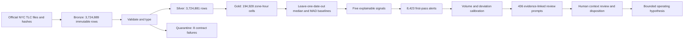

# NYC Mobility Operations Anomaly Review System

An explainable decision-support system that turns 3,724,889 official taxi-trip records into 436 ranked, evidence-linked prompts for human investigation.


[Live case study](https://nyc-mobility-operations.vercel.app/?v=3ps) | [Project story](PROJECT_STORY.md) | [Interview brief](INTERVIEW_SO_WHAT.md) | [Data contract](pipeline/phase-3/contracts/PHASE3_DATA_METRIC_CONTRACT.md)

## 30-second brief

| Question | Answer |
| --- | --- |
| Who is this for? | A taxi fleet operations leader deciding where driver supply, dispatch attention, and disruption review should go first. |
| What is the costly problem? | Millions of trip records describe completed activity but do not rank the zone-hours that deserve operational review. |
| What did I build? | A reproducible Bronze-to-Silver-to-Gold pipeline with record quarantine, robust zone-hour baselines, five explainable signals, evidence receipts, and a human review queue. |
| What changed in the system? | An unreviewable first pass of 8,423 alerts became 436 evidence-linked prompts, a 94.8% reduction. The automated suites passed 1/1 Phase 2 test and 8/8 Phase 3 tests. |
| What remains unproved? | Fleet adoption, production precision and recall, driver-revenue impact, passenger wait-time improvement, and causal attribution. |

## Why a company pays for this

A fleet loses money when drivers wait where demand has dropped, miss event-driven demand shifts, or return to normal staffing before a disruption has cleared. More raw data does not resolve the decision. A smaller, traceable review queue does.

| Operating problem | System response | Value mechanism to test |
| --- | --- | --- |
| Analysts cannot review thousands of alerts | Volume and deviation gates reduce the queue by 94.8% | Less analyst time spent on noise |
| A zone-hour looks unusual but the reason is unclear | Every prompt links to its baseline, deviation, source rows, and evidence query | Faster investigation and handoff |
| Bad records silently distort metrics | Typed contracts and quarantine preserve failures | Higher trust in downstream decisions |
| Event, airport, or weather conditions shift demand | Ranked zone-hour prompts identify where context review should start | Better driver staging and dispatch hypotheses |
| Statistical deviation is mistaken for cause | Human disposition is required before action | Lower risk of acting on an unsupported explanation |

The money metrics for a controlled fleet pilot are trips per driver-hour, revenue per online hour, empty miles, airport waiting time, and passenger pickup delay. None has been measured in production.

## System architecture



## Verified proof

| Evidence | Result | Where to inspect |
| --- | ---: | --- |
| Official Bronze records | 3,724,889 | [Source manifest](pipeline/phase-1/DATA_MANIFEST.md) |
| Typed Silver records | 3,724,881 | [Phase 2 quality report](pipeline/phase-2/reports/quality_report.json) |
| Quarantined contract failures | 8 | [Phase 2 quality report](pipeline/phase-2/reports/quality_report.json) |
| Gold zone-hour cells | 194,928 | [Phase 3 run metrics](pipeline/phase-3/reports/run_metrics.json) |
| Documented first-pass alerts | 8,423 | [Project process record](PROJECT_STORY.md#process) |
| Final review prompts | 436 | [Human review queue](pipeline/phase-3/review/human_review_queue.csv) |
| Evidence-linked prompts | 436 / 436 | [Phase 3 run metrics](pipeline/phase-3/reports/run_metrics.json) |
| Alert reduction | 94.8% | [Project process record](PROJECT_STORY.md#process) |
| Automated tests | Phase 2: 1 / 1 passed; Phase 3: 8 / 8 passed | [Phase 2 tests](pipeline/phase-2/tests/) and [Phase 3 tests](pipeline/phase-3/tests/) |

## Three investigation examples

These are review prompts, not causal findings.

| Scenario | Evidence surfaced | Operator question |
| --- | --- | --- |
| New Year's event | Times Square recorded 0 pickups at midnight against a 78.5 baseline, while surrounding zones showed large increases | Should drivers stage outside closure boundaries during similar events? |
| LaGuardia winter storm | Airport pickups fell to 0 during two late-night hours against baselines of 230 and 325 | Should dispatch verify airport status before sending more vehicles? |
| Post-storm recovery | Duration and fare-per-mile prompts remained concentrated in Manhattan after snowfall | Should recovery monitoring continue after weather conditions appear normal? |

The live case study shows the evidence path and the operational metric each hypothesis would need to improve.

## The important engineering choices

### Preserve unknowns

Missing passenger counts remain unknown. The pipeline does not impute values to make the dataset look cleaner.

### Quarantine contract failures

Seven month-boundary pickups and one record with drop-off before pickup are isolated instead of silently repaired.

### Compare like with like

Each zone-hour is compared with the same zone, weekday, and hour using leave-one-date-out medians and median absolute deviation. The current method still does not control for weather, holidays, closures, or provider reporting changes.

### Calibrate against human capacity

The first 8,423-alert configuration failed the operational test. A human team would not review it. Stronger eligibility and deviation gates reduced the result to 436 prompts while preserving evidence links.

## Inspect it in five minutes

1. Open the [live case study](https://nyc-mobility-operations.vercel.app/?v=3ps).
2. Select the New Year's, LaGuardia, and post-storm scenarios.
3. Follow one prompt from signal to evidence to human decision.
4. Compare the 8,423-alert first pass with the 436-prompt calibrated queue.
5. Read the boundary before treating a deviation as cause or impact.

## Honest boundary

This repository proves public-data ingestion, source hashing, typed contracts, quarantine, explainable anomaly scoring, threshold calibration, deterministic tests, query-level provenance, and human approval boundaries.

It does not prove production fleet ownership, operator adoption, revenue or service improvement, causation, fraud, prescribed action, or an autonomous AI agent. The current product is a deterministic anomaly-review system.

## Reproduce the pipeline

Download the official January 2026 Yellow Taxi Parquet file into `pipeline/phase-1/yellow_tripdata_2026-01.parquet`, then run:

```bash
cd pipeline/phase-2
python3 -m venv .venv
.venv/bin/pip install -r requirements.txt
.venv/bin/python src/prepare_phase2.py
.venv/bin/python -m unittest discover -s tests -p 'test_*.py'
.venv/bin/python tests/seeded_validation.py

cd ../phase-3
python3 -m venv .venv
.venv/bin/pip install -r requirements.txt
.venv/bin/python src/build_phase3.py
.venv/bin/python -m unittest discover -s tests -p 'test_*.py'
.venv/bin/python tests/seeded_evaluation.py
```

## Data sources

• [NYC TLC Trip Record Data](https://www.nyc.gov/site/tlc/about/tlc-trip-record-data.page)

• [Official January 2026 Yellow Taxi Parquet](https://d37ci6vzurychx.cloudfront.net/trip-data/yellow_tripdata_2026-01.parquet)

• [Official Taxi Zone Lookup CSV](https://d37ci6vzurychx.cloudfront.net/misc/taxi_zone_lookup.csv)

• [Official Taxi Zone shapefile](https://d37ci6vzurychx.cloudfront.net/misc/taxi_zones.zip)

Built by [Sidd Chauhan](https://siddchauhan.vercel.app) as evidence for AI Solutions Engineer, Forward Deployed Engineer, data-product, and operations-analytics roles.
