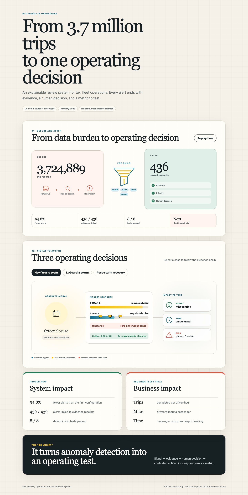

# NYC Mobility Operations Anomaly Review System

An explainable decision-support case study built from 3,724,889 official January 2026 NYC Yellow Taxi trip records.

[Open the live case study](https://nyc-mobility-operations.vercel.app/?v=3ps)



## Problem

Raw trip records describe completed activity. They do not tell an operations team which zone-hour changes deserve attention first.

The project asks:

> How do we turn public mobility records into a smaller, explainable review queue without presenting statistical deviation as cause, fraud, or operational failure?

## Process

• Preserved the official source manifest and SHA-256 hashes.

• Converted raw records into typed Silver data.

• Quarantined contract failures instead of silently repairing them.

• Built leave-one-date-out zone, weekday, and hour baselines using median and MAD.

• Scored trip volume, gross fare per trip, median duration, fare per mile, and payment-method mix.

• Linked every final prompt to evidence and a human-review record.

• Evaluated normal variation and a seeded demand spike.

## Verified system results

| Measure | Result |
| --- | ---: |
| Bronze records | 3,724,889 |
| Silver records | 3,724,881 |
| Quarantined records | 8 |
| Zone-hour Gold cells | 194,928 |
| First-pass alerts | 8,423 |
| Final review prompts | 436 |
| Alert-volume reduction | 94.8% |
| Evidence-linked prompts | 436 / 436 |
| Deterministic tests | 8 / 8 passed |

## Honest boundary

This repository proves data-quality controls, explainable anomaly scoring, threshold calibration, provenance, seeded evaluations, and human approval boundaries.

It does not prove:

• Production fleet ownership

• Operator adoption

• Revenue or service improvement

• Causation, fraud, or prescribed action

• An autonomous or LLM-based agent

The proposed next deployment is a 30-day controlled pilot with a fleet operations director. Test zones would be compared with matched controls using trips per driver-hour, revenue per online hour, empty miles, and pickup delay.

## Repository map

```text
pipeline/
  phase-1/     source manifest and official zone lookup
  phase-2/     data-quality code, contract, tests, and reports
  phase-3/     anomaly code, metric contract, tests, reports, and review queue
impact-visual/ public interactive case study
carousel/      six case-study graphics
```

Generated Parquet datasets and the 64.2 MB official monthly trip file stay outside Git. The scripts recreate them from the official source input.

## Reproduce the pipeline

1. Download the official January 2026 Yellow Taxi Parquet file into `pipeline/phase-1/yellow_tripdata_2026-01.parquet`.

2. Run Phase 2:

```bash
cd pipeline/phase-2
python3 -m venv .venv
.venv/bin/pip install -r requirements.txt
.venv/bin/python src/prepare_phase2.py
.venv/bin/python -m unittest discover -s tests -p 'test_*.py'
.venv/bin/python tests/seeded_validation.py
```

3. Run Phase 3:

```bash
cd ../phase-3
python3 -m venv .venv
.venv/bin/pip install -r requirements.txt
.venv/bin/python src/build_phase3.py
.venv/bin/python -m unittest discover -s tests -p 'test_*.py'
.venv/bin/python tests/seeded_evaluation.py
```

## Run the case study locally

```bash
python3 -m http.server 8793
```

Open `http://localhost:8793/impact-visual/`.

## Data sources

• [NYC TLC Trip Record Data](https://www.nyc.gov/site/tlc/about/tlc-trip-record-data.page)

• [Official January 2026 Yellow Taxi Parquet](https://d37ci6vzurychx.cloudfront.net/trip-data/yellow_tripdata_2026-01.parquet)

• [Official Taxi Zone Lookup CSV](https://d37ci6vzurychx.cloudfront.net/misc/taxi_zone_lookup.csv)

• [Official Taxi Zone shapefile](https://d37ci6vzurychx.cloudfront.net/misc/taxi_zones.zip)
